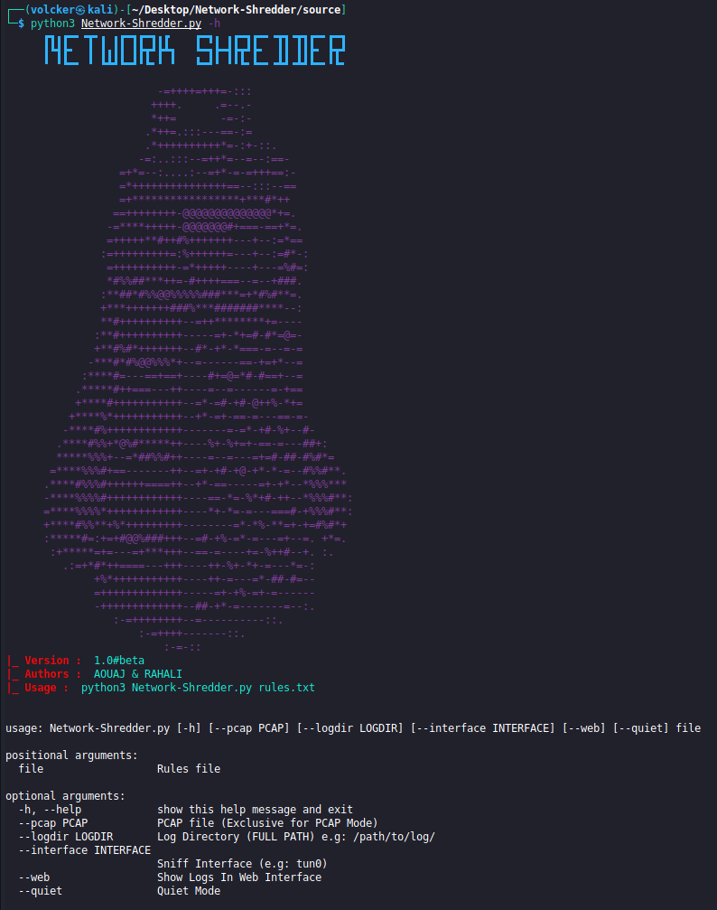

# Network-Shredder

Network-Shredder is a python based NIDS.


## Installation

```bash
git clone https://github.com/v0lck3r/Network-Shredder.git
cd Network-Shredder
pip3 install -r requirements.txt
```

## Example usage

### Help menu 

```bash
python3 Network-Shredder.py -h
````


### Live mode 

```bash 
python3 Network-Shredder.py rules.txt --interface tun0
```

### Start web application 

```bash 
python3 Network-Shredder.py rules.txt --interface tun0 --web
```

### Console quiet mode 

```bash 
python3 Network-Shredder.py rules.txt --interface tun0 --web --quiet
```

### Specify log directory   

```bash 
python3 Network-Shredder.py rules.txt --logdir /tmp/ --interface tun0 --web
```

### Pcap based detection 

```bash 
python3 Network-Shredder.py rules.txt --pcap pcap_file.pcap
```


## 📫 Credits: 
***OUSSAMA RAHALI*** & ***OMAR AOUAJ*** 
